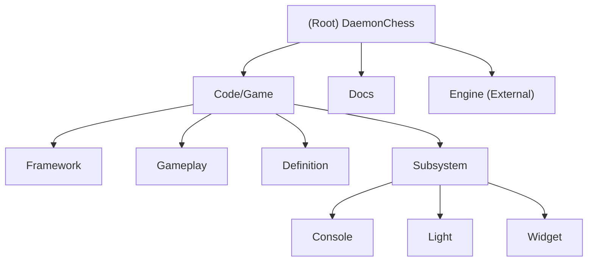

# DaemonChess - 3D Chess Simulator

## Changelog
- **2025-09-10**: Initial AI context initialization - Core architecture documented, module structure identified, networking subsystem fixes in progress

## Project Vision

DaemonChess is a sophisticated turn-based 3D chess simulator built with modern graphics technology and the custom Daemon Engine. This project combines traditional chess gameplay with advanced 3D visualization, featuring realistic lighting effects, smooth animations, and future networked multiplayer capabilities. It serves as a comprehensive showcase of modern C++ game development techniques, advanced graphics programming, and custom game engine architecture.

## Architecture Overview

The project follows a layered architecture pattern with clear separation between:
- **Application Layer**: Main application lifecycle and windowing (App, Main_Windows)  
- **Game Logic Layer**: Core chess gameplay mechanics (Game, Match, Board, Piece)
- **Framework Layer**: Controllers, common systems, and abstractions (PlayerController, AIController)
- **Definition Layer**: Data-driven definitions for game entities (PieceDefinition, BoardDefinition)
- **Subsystem Layer**: Specialized services (Console, Light, Widget subsystems)
- **Engine Layer**: Custom Daemon Engine providing rendering, math, audio, networking foundations

## Module Structure Diagram

## Module Index

| Module | Path | Responsibility | Status |
|--------|------|----------------|---------|
| **Framework** | `Code/Game/Framework/` | Application lifecycle, controllers, windowing, and common systems | Active |
| **Gameplay** | `Code/Game/Gameplay/` | Core chess game logic, match management, board and piece systems | Active |
| **Definition** | `Code/Game/Definition/` | Data-driven definitions for pieces and board configuration | Stable |
| **Subsystem** | `Code/Game/Subsystem/` | Specialized services (console, lighting, widget management) | Active |
| **Documentation** | `Docs/` | Project documentation, UML diagrams, and README files | Maintained |

## Running and Development

### Prerequisites
- **Visual Studio 2022** or later
- **Windows 10 SDK** (10.0.19041.0 or later)  
- **DirectX 11** compatible graphics card
- **Git** for version control

### Build Process
1. Open `DaemonChess.sln` in Visual Studio
2. Ensure platform is set to `x64`
3. Select `Debug` or `Release` configuration
4. Build solution (`Ctrl+Shift+B`)
5. Run with `F5` (debug) or `Ctrl+F5` (release)

### Project Structure
- **Source Code**: `Code/Game/` - All game-specific C++ source files
- **Engine Code**: `../Engine/Code/` - Custom Daemon Engine (external dependency)
- **Build Output**: `Temporary/` - Compilation artifacts  
- **Runtime**: `Run/` - Final executable location
- **Documentation**: `Docs/` - Architecture diagrams and project documentation

## Testing Strategy

Currently the project focuses on manual testing and interactive debugging:
- **Manual Testing**: Interactive chess gameplay testing through the main application
- **Debug Systems**: In-game console for command execution and state inspection
- **Visual Debugging**: Debug rendering systems for collision detection and game state visualization
- **Network Testing**: TCP connection testing for multiplayer features (in development)

**Future Testing Plans**:
- Unit tests for chess move validation logic
- Integration tests for network multiplayer functionality  
- Automated UI testing for game state transitions

## Coding Standards

### C++ Standards
- **Language Standard**: C++17
- **Naming Convention**: PascalCase for classes/methods, camelCase for variables, ALL_CAPS for constants
- **File Organization**: `.hpp` headers, `.cpp` implementations
- **Memory Management**: Manual memory management with RAII patterns and safe release macros

### Code Organization
- **Header Guards**: `#pragma once` preferred
- **Dependencies**: Clear separation between engine and game code
- **Forward Declarations**: Used to minimize header dependencies
- **Event System**: Event-driven architecture for loose coupling

### Quality Standards  
- **Warning Level**: Level 4 warnings enabled
- **SDL Checks**: Security Development Lifecycle checks enabled
- **Conformance**: Full C++ standard conformance mode
- **Platform**: Windows-first with cross-platform considerations

## AI Usage Guidelines

### Recommended AI Assistance Areas
- **Code Review**: Architecture analysis, potential bug identification, performance optimization suggestions
- **Documentation**: Technical writing assistance, API documentation generation, code comments
- **Debugging**: Log analysis, error pattern identification, debugging strategy suggestions  
- **Refactoring**: Code organization improvements, design pattern applications
- **Testing**: Test case generation, edge case identification, testing strategy development

### AI Limitations and Cautions
- **Engine Integration**: Custom Daemon Engine specifics require domain knowledge - verify suggestions against engine documentation
- **Graphics Programming**: DirectX 11 and shader code require careful validation
- **Network Programming**: TCP networking implementation needs thorough testing
- **Performance**: Graphics performance optimizations should be profiled and measured
- **Game Logic**: Chess rule validation logic is critical - verify all move validation changes thoroughly

### Best Practices for AI Collaboration
1. **Context Provision**: Always provide relevant code context when requesting assistance
2. **Incremental Changes**: Request small, focused improvements rather than large refactors
3. **Validation**: Test and verify all AI-suggested changes, especially in core game logic
4. **Documentation**: Ask for explanation of suggested changes and their implications
5. **Engine Compatibility**: Verify suggestions are compatible with the custom Daemon Engine architecture